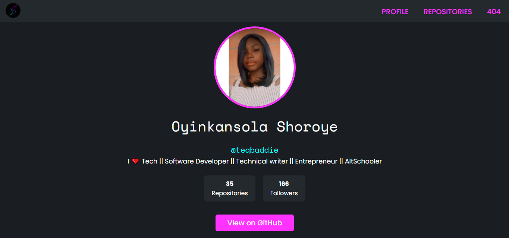

<!-- Project Shields -->
<a name="readme-top"></a>


<div align="center">

  [![Contributors][contributors-shield]][contributors-url]
  [![Forks][forks-shield]][forks-url]
  [![Stargazers][stars-shield]][stars-url]
  [![Issues][issues-shield]][issues-url]
  [![Twitter][twitter-shield]][twitter-url]
</div>

<!-- Project Logo -->
<br />
<div align="center">
  
</div>

<br />

<div>
  <p align="center">
    <a href="https://github.com/teqbaddie/teqbaddie-repos#readme"><strong>Explore the docs »</strong></a>
    <br />
    <br />
    <a href="https://teqbaddie-repositories.netlify.app/">View Project Live</a>
    ·
    <a href="https://github.com/teqbaddie/teqbaddie-repos/issues">Report Bug</a>
    ·
    <a href="https://github.com/teqbaddie/teqbaddie-repos/issues">Request Feature</a>
  </p>
</div>

---

<!-- Table of Contents -->
<details>
  <summary>Table of Contents</summary>
  <ol>
    <li>
      <a href="#about-teqbaddie-repos">About Teqbaddie GitHub Repos</a>
      <ul>
        <li><a href="#technologies-used">Technologies Used</a></li>
      </ul>
    </li>
    <li>
      <a href="#lessons-learned">Lessons Learned</a>
    </li>
    <li>
      <a href="#usage">Usage</a>
      <ul>
        <li><a href="#prerequisites">Prerequisites</a></li>
        <li><a href="#installation">Installation</a></li>
      </ul>
    </li>    
    <li><a href="#sample">Sample</a></li>
    <li><a href="#acknowledgements">Acknowledgements</a></li>
  </ol>
</details>

---


<!-- Markdown Links & Images -->
[contributors-shield]: https://img.shields.io/github/contributors/teqbaddie/teqbaddie-repos.svg?style=for-the-badge
[contributors-url]: https://github.com/teqbaddie/teqbaddie-repos/graphs/contributors
[forks-shield]: https://img.shields.io/github/forks/teqbaddie/teqbaddie-repos.svg?style=for-the-badge
[forks-url]: https://github.com/teqbaddie/teqbaddie-repos/network/members
[stars-shield]: https://img.shields.io/github/stars/teqbaddie/teqbaddie-repos.svg?style=for-the-badge
[stars-url]: https://github.com/teqbaddie/teqbaddie-repos/stargazers
[issues-shield]: https://img.shields.io/github/issues/teqbaddie/teqbaddie-repos.svg?style=for-the-badge
[issues-url]: https://github.com/Teqbaddie/teqbaddie-reposissues
[twitter-shield]: https://img.shields.io/badge/-@teq_baddie-1ca0f1?style=for-the-badge&logo=twitter&logoColor=white&link=https://twitter.com/teq_baddie
[twitter-url]: https://twitter.com/teq_baddie
[html5]: https://img.shields.io/badge/html5-%23E34F26.svg?style=for-the-badge&logo=html5&logoColor=white
[css3]: https://img.shields.io/badge/css3-%231572B6.svg?style=for-the-badge&logo=css3&logoColor=white
[javascript]: https://img.shields.io/badge/javascript-%23323330.svg?style=for-the-badge&logo=javascript&logoColor=%23F7DF1E
[vue]: https://img.shields.io/badge/vue-%2341B883.svg?style=for-the-badge&logo=vue.js&logoColor=white


<!-- About the Project -->
## About Teqbaddie GitHub Repos

This project is a my last semester examination project from AltSchool Africa, School of Engineering, it is a Vue.js application that displays a list of all the GitHub repositories of a user. It uses the GitHub API to fetch the list of repositories and shows them with pagination. It also has a page that displays details of a single repo clicked from the list of repos. This project also implements a wildcard route to catch 404 pages.

It implements pagination, a single repo page, and a wildcard route to catch 404 pages. It is a simple project designed to demonstrate the use of the Vue.js framework.

<b> Project Question No. 1 </b>
Create a new vue js application then using the GitHub API, fetch your GitHub repositories using this endpoint https://api.github.com/users/{{USERNAME}}/repos. show a page with a list of all your repositories on GitHub(the page should have some form of pagination). Then create another page showing data for a single repo clicked from the list of repos using nested routes. Make sure to implement a wildcard route to catch 404 pages. NB: Good UI and Designs are important.

### Technologies Used

MyDomot is a React-based application, built with the following technologies: 

- ![HTML5][html5]
- ![CSS3][css3]
- ![JavaScript][javascript]
- ![Vue][vue]

<p align="right"><a href="#readme-top">back to top</a></p>

---

<!-- Lessons from the Project -->
## Lessons Learned

The Github Repo App project has given me a good understanding of the Vue.js framework. I have learned the fundamentals of creating components, using props to pass data between components, and using vue-router to create nested routing. I have also had the opportunity to work with the GitHub API and to apply concepts such as pagination and wildcard routing.

<p align="right"><a href="#readme-top">back to top</a></p>

---

<!-- GETTING STARTED -->
## Usage

To get a local copy up and running, follow the steps below.

### Prerequisites

The following technologies are required to run the application:
* [Vue](https://vuejs.org/)

### Installation

To get started, clone the repository and run the following commands:

1. Clone the repository
```bash
git clone https://github.com/teqbaddie/MyDomot.git
```
2. Install dependencies
```bash
npm install
```
3. Run the application
```bash
npm run serve
```
This will start the application on `http://localhost:8080`.

<p align="right"><a href="#readme-top">back to top</a></p>

---

<!-- Sample -->
## Sample

<br />


<br/>

<p align="right"><a href="#readme-top">back to top</a></p>

---

<!-- Acknowledgements -->
## Acknowledgements

This project was made possible by:

* [AltSchool Africa School of Engineering](https://altschoolafrica.com/schools/engineering)
* [Iyke Evans's Vue Lessons at AltSchool Africa](https://github.com/iykeevans)
* [Olo Oluwasetemi's Vue Lessons at AltSchool Africa](https://github.com/oluwasetemi)


<p align="right"><a href="#readme-top">back to top</a></p>
